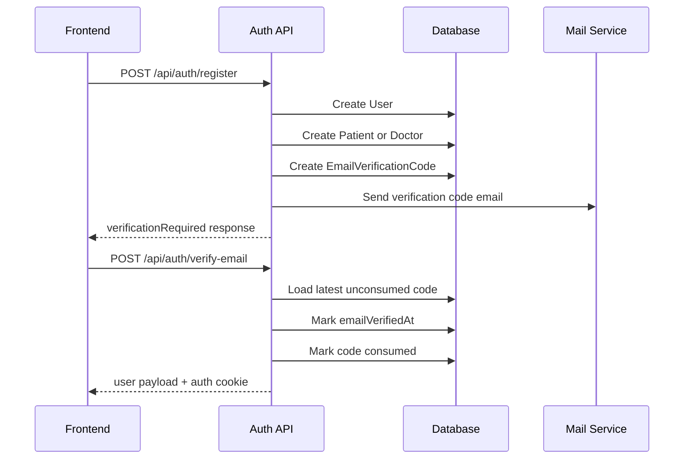
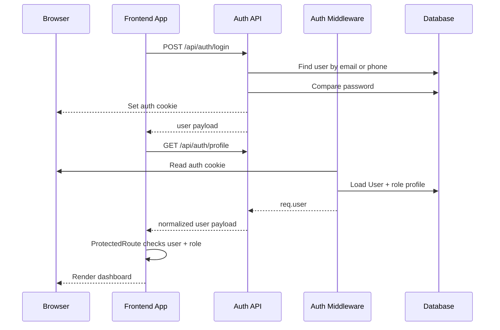
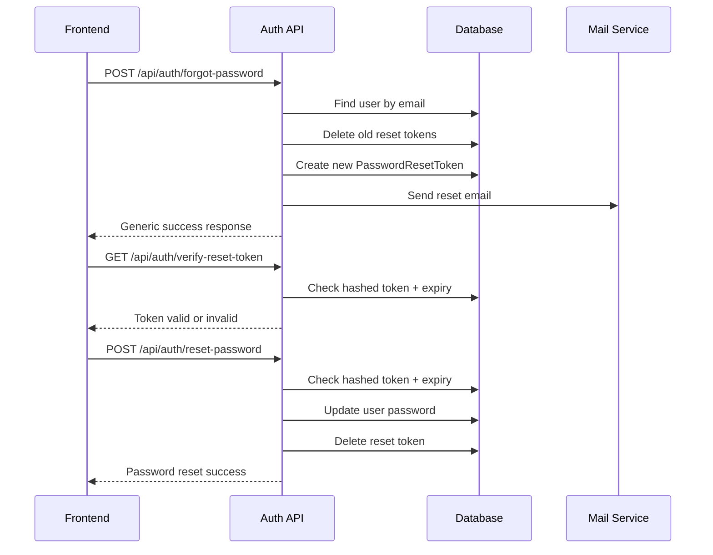

# CureNet Authentication System Guide

This document explains the CureNet authentication system from start to finish.

It is written for learning and maintenance:
- what auth does in this project
- how login state is created and stored
- which files own which part of the flow
- how roles work
- how email verification works
- how password reset works
- how frontend route protection works
- what the main API responses look like

## 1. Big Picture

The auth system is cookie-first JWT authentication with role-based access control.

In plain language:

1. a user registers
2. the backend creates a `User`
3. for self-registration, the backend also creates the matching role profile:
   - `Patient`
   - or `Doctor`
4. the backend creates an email verification code
5. the user verifies the code from email
6. after verification, the backend signs a JWT
7. the JWT is stored in an HTTP-only cookie
8. future requests use that cookie automatically
9. protected backend routes load `req.user`
10. frontend route guards use the profile from `/auth/profile`

Important detail:
- the browser does not store the JWT in local storage
- the JWT is primarily stored in a secure cookie
- the middleware also accepts a bearer token, but the app is designed around cookie auth

## 2. Main Concepts

### `User`
This is the root identity model.

It stores:
- email
- hashed password
- name
- phone
- date of birth
- gender
- address
- role
- active/deactivated state
- email verification timestamp

Why it exists:
- every authenticated person needs one identity row
- role-specific data should not live in the same table
- the app needs one common place for login credentials and shared profile fields

### Role profile tables
These extend `User`.

- `Patient`
- `Doctor`
- `Receptionist`

Why they exist:
- different roles need different operational fields
- not every user has doctor data or patient data
- role-specific tables keep the model cleaner

### JWT
The signed token contains:
- `userId`

Why it exists:
- the server needs a portable way to identify the logged-in user on every request
- the token is lightweight and easy to validate

### Auth cookie
The app stores the JWT inside the cookie named:
- `curenet_auth` by default

Why it exists:
- browser requests automatically include it
- `httpOnly` helps prevent frontend JavaScript from reading the token directly

### Email verification code
Newly registered users are not considered verified until they enter the emailed code.

Why it exists:
- prevents fake or mistyped emails from becoming active identities
- supports resend and attempt throttling

### Password reset token
This is a separate one-time flow for password recovery.

Why it exists:
- you do not reuse the auth JWT for password reset
- reset links need their own short-lived token lifecycle

## 3. File Map

### Backend auth core

- [backend/src/controllers/authController.js](/home/sanzid/playground/curenet/backend/src/controllers/authController.js)
  - main auth business logic
  - register
  - login
  - logout
  - email verification
  - profile load/update
  - forgot password
  - reset password
- [backend/src/routes/auth.js](/home/sanzid/playground/curenet/backend/src/routes/auth.js)
  - mounts auth endpoints under `/api/auth`
- [backend/src/middleware/auth.js](/home/sanzid/playground/curenet/backend/src/middleware/auth.js)
  - reads JWT from cookie or bearer token
  - loads `req.user`
  - role authorization middleware
- [backend/src/config/security.js](/home/sanzid/playground/curenet/backend/src/config/security.js)
  - JWT secret validation
  - `TRUST_PROXY` handling
- [backend/src/index.js](/home/sanzid/playground/curenet/backend/src/index.js)
  - mounts auth routes
  - configures CORS
  - enables trust proxy

### Backend auth data

- [backend/src/models/User.js](/home/sanzid/playground/curenet/backend/src/models/User.js)
  - identity model
  - password hashing hooks
- [backend/src/models/EmailVerificationCode.js](/home/sanzid/playground/curenet/backend/src/models/EmailVerificationCode.js)
  - verification code storage
- [backend/src/models/PasswordResetToken.js](/home/sanzid/playground/curenet/backend/src/models/PasswordResetToken.js)
  - password reset token storage
- [backend/src/models/Patient.js](/home/sanzid/playground/curenet/backend/src/models/Patient.js)
  - patient profile extension
- [backend/src/models/Doctor.js](/home/sanzid/playground/curenet/backend/src/models/Doctor.js)
  - doctor profile extension
- [backend/src/models/Receptionist.js](/home/sanzid/playground/curenet/backend/src/models/Receptionist.js)
  - receptionist profile extension

### Backend supporting services

- [backend/src/lib/mail.js](/home/sanzid/playground/curenet/backend/src/lib/mail.js)
  - sends verification and password reset emails
- [backend/src/lib/auditLog.js](/home/sanzid/playground/curenet/backend/src/lib/auditLog.js)
  - records login audit entries

### Frontend auth flow

- [frontend/src/context/AuthContext.tsx](/home/sanzid/playground/curenet/frontend/src/context/AuthContext.tsx)
  - owns frontend auth state
  - loads `/auth/profile`
  - exposes `login`, `register`, `verifyEmail`, `logout`
- [frontend/src/components/ProtectedRoute.tsx](/home/sanzid/playground/curenet/frontend/src/components/ProtectedRoute.tsx)
  - blocks anonymous users
  - optionally enforces a role
- [frontend/src/components/RoleBasedRedirect.tsx](/home/sanzid/playground/curenet/frontend/src/components/RoleBasedRedirect.tsx)
  - redirects logged-in users to the correct dashboard
- [frontend/src/components/Navbar.tsx](/home/sanzid/playground/curenet/frontend/src/components/Navbar.tsx)
  - logout trigger
- [frontend/src/lib/runtimeConfig.ts](/home/sanzid/playground/curenet/frontend/src/lib/runtimeConfig.ts)
  - resolves deployed API origin

## 4. The Data Model

## 4.1 `User`

Defined in [backend/src/models/User.js](/home/sanzid/playground/curenet/backend/src/models/User.js).

Important fields:
- `id`
- `email`
- `password`
- `firstName`
- `lastName`
- `phone`
- `dateOfBirth`
- `gender`
- `address`
- `role`
  - `patient`
  - `doctor`
  - `admin`
  - `receptionist`
- `isActive`
- `emailVerifiedAt`

Important behavior:
- `beforeCreate` hashes the password
- `beforeUpdate` re-hashes if password changed
- `comparePassword()` checks a plaintext candidate
- `toJSON()` removes the password from API output

Why password hooks matter:
- controller code can assign `user.password = newPassword`
- the model handles hashing automatically

## 4.2 `EmailVerificationCode`

Defined in [backend/src/models/EmailVerificationCode.js](/home/sanzid/playground/curenet/backend/src/models/EmailVerificationCode.js).

Important fields:
- `userId`
- `purpose`
- `codeHash`
- `expiresAt`
- `consumedAt`
- `resendCount`
- `attemptCount`
- `lastSentAt`

Important behavior:
- `generateCode()` creates a 6-digit code
- `hashCode()` hashes the code before storing it

Why the code is hashed:
- the raw verification code should not sit in the database in plaintext

## 4.3 `PasswordResetToken`

Defined in [backend/src/models/PasswordResetToken.js](/home/sanzid/playground/curenet/backend/src/models/PasswordResetToken.js).

Important fields:
- `userId`
- `token`
- `expiresAt`

Important behavior:
- `generateToken()` creates a long random token
- the controller hashes the incoming token before lookup

Why it is separate from the auth JWT:
- reset links should be one-purpose and revocable
- auth tokens should not be reused for account recovery

## 5. Security and Runtime Rules

Key config lives in [backend/src/config/security.js](/home/sanzid/playground/curenet/backend/src/config/security.js).

### `JWT_SECRET`
- required always
- must be at least 32 chars in production

### `JWT_EXPIRES_IN`
- default is `7d`

### `AUTH_COOKIE_NAME`
- default is `curenet_auth`

### Cookie behavior
Set in `getAuthCookieOptions()` in [authController.js](/home/sanzid/playground/curenet/backend/src/controllers/authController.js).

Development:
- `httpOnly: true`
- `secure: false`
- `sameSite: 'lax'`

Production:
- `httpOnly: true`
- `secure: true`
- `sameSite: 'strict'`

Why this matters:
- `secure: true` means the cookie is only sent over HTTPS
- this is why the deploy stack needed HTTPS to behave like production

### `TRUST_PROXY`
Used in [backend/src/index.js](/home/sanzid/playground/curenet/backend/src/index.js).

Why it matters:
- when HTTPS is terminated by Nginx, Express needs proxy awareness
- otherwise cookie and IP behavior can be wrong

### CORS
Also configured in [backend/src/index.js](/home/sanzid/playground/curenet/backend/src/index.js).

Important behavior:
- only configured origins are allowed
- credentials are enabled
- that is required for cookie-based browser auth

## 6. End-to-End Flows

## 6.1 Registration Flow

Route:
- `POST /api/auth/register`

Controller:
- `register()` in [authController.js](/home/sanzid/playground/curenet/backend/src/controllers/authController.js)

What it does:

1. validates required fields
   - `email`
   - `password`
   - `firstName`
   - `lastName`
2. validates password strength
3. blocks self-registration as `admin`
4. allows only:
   - `patient`
   - `doctor`
   - anything else defaults to `patient`
5. checks whether the email already exists
6. starts a DB transaction
7. creates the `User`
8. creates role extension:
   - `Doctor` for doctor role
   - `Patient` for patient role
9. creates an `EmailVerificationCode`
10. commits the transaction
11. sends verification email
12. returns a verification-pending response

Important design choice:
- registration does not log the user in immediately
- verification must happen first

Success response shape:

```json
{
  "success": true,
  "message": "Account created. Check your email for the verification code.",
  "data": {
    "verificationRequired": true,
    "email": "user@example.com",
    "verificationExpiresAt": "2026-03-28T12:00:00.000Z"
  }
}
```

Important error cases:
- weak password -> `400`
- admin self-registration -> `400`
- verified email already exists -> `400`
- unverified email already exists -> `409`
- account created but email send failed -> `503`

## 6.2 Email Verification Flow

Route:
- `POST /api/auth/verify-email`

Controller:
- `verifyEmail()`

What it does:

1. loads the user by email
2. ensures the user is active
3. if already verified, it issues auth immediately
4. loads the newest unconsumed verification record
5. checks expiry
6. checks max attempts
7. compares hashed code
8. increments `attemptCount` on wrong code
9. on success:
   - sets `user.emailVerifiedAt`
   - sets `record.consumedAt`
   - issues auth cookie
   - returns user payload

Success response shape:

```json
{
  "success": true,
  "data": {
    "user": {
      "id": 1,
      "email": "user@example.com",
      "role": "patient"
    }
  }
}
```

Key point:
- verification is also the first login for a new user

## 6.3 Resend Verification Code

Route:
- `POST /api/auth/resend-verification-code`

Controller:
- `resendVerificationCode()`

Rules:
- email required
- user must exist and be active
- already verified users are rejected
- minimum resend interval is `60 seconds`

What it does:
- creates a new verification record
- emails the new code
- deletes older unconsumed verification records

Success response:

```json
{
  "success": true,
  "message": "Verification code sent",
  "data": {
    "verificationRequired": true,
    "email": "user@example.com",
    "verificationExpiresAt": "2026-03-28T12:05:00.000Z"
  }
}
```

## 6.4 Login Flow

Route:
- `POST /api/auth/login`

Controller:
- `login()`

What it accepts:
- `{ email, password }`
- or `{ phone, password }`

Frontend behavior:
- [AuthContext.tsx](/home/sanzid/playground/curenet/frontend/src/context/AuthContext.tsx) checks whether the identifier looks like an email
- if yes, sends `email`
- otherwise sends `phone`

What backend login does:

1. validates identifier + password presence
2. looks up the user by email or phone
3. includes role tables:
   - `Doctor`
   - `Patient`
   - `Receptionist`
4. compares password
5. ensures account is active
6. blocks unverified users unless `AUTH_ALLOW_UNVERIFIED_LOGIN=true`
7. writes audit log
8. signs JWT
9. sets auth cookie
10. returns formatted user

Success response:

```json
{
  "success": true,
  "data": {
    "user": {
      "id": 1,
      "email": "user@example.com",
      "role": "doctor",
      "doctorId": 12,
      "clinicId": 4,
      "clinic": {
        "id": 4,
        "name": "CureNet Central"
      }
    }
  }
}
```

Important error cases:
- wrong credentials -> `401`
- inactive account -> `403`
- unverified email -> `403` with code `EMAIL_NOT_VERIFIED`

## 6.5 Cookie Issue After Login

Auth issuance happens in `issueAuthResponse()` in [authController.js](/home/sanzid/playground/curenet/backend/src/controllers/authController.js).

It does:
- `signToken(user.id)`
- `setAuthCookie(res, token)`
- reloads the full auth user
- returns user payload

That means the login response does two jobs:
- gives the frontend the user object immediately
- also establishes browser session state for future requests

## 6.6 Profile Load Flow

Route:
- `GET /api/auth/profile`

Protected by:
- `authenticateToken`

Frontend behavior:
- [AuthContext.tsx](/home/sanzid/playground/curenet/frontend/src/context/AuthContext.tsx) calls this on app boot

Why it exists:
- the frontend should not trust only “I logged in earlier”
- it asks the backend who the authenticated user is right now

What it returns:
- one normalized user object for the frontend

This is the endpoint that determines:
- whether the app considers you logged in after reload
- what role dashboard you get
- what clinic context is available in the shell

## 6.7 Profile Update Flow

Route:
- `PUT /api/auth/profile`

Protected by:
- `authenticateToken`

What it updates:
- `firstName`
- `lastName`
- `phone`
- `dateOfBirth`
- `gender`
- `address`

What it does after update:
- reloads the full user with related profile tables
- returns the normalized auth user response again

This is why the frontend can replace its in-memory auth user after profile changes.

## 6.8 Logout Flow

Route:
- `POST /api/auth/logout`

Controller:
- `logout()`

What it does:
- clears the auth cookie
- returns success JSON

Frontend behavior:
- [AuthContext.tsx](/home/sanzid/playground/curenet/frontend/src/context/AuthContext.tsx) clears local state even if the server call fails

That is a good UX choice:
- user intent is logout
- stale frontend state should not survive a failed network call

## 6.9 Forgot Password Flow

Route:
- `POST /api/auth/forgot-password`

Controller:
- `forgotPassword()`

What it does:

1. accepts `email`
2. if user not found, still returns generic success
3. generates reset token
4. hashes it before storing
5. deletes old reset tokens for that user
6. stores new reset token with 1-hour expiry
7. sends reset email

Why the generic success message matters:
- it avoids telling attackers whether an email exists

Typical response:

```json
{
  "success": true,
  "message": "If that email exists, we sent a reset link"
}
```

## 6.10 Verify Reset Token

Route:
- `GET /api/auth/verify-reset-token?token=...`

Controller:
- `verifyResetToken()`

What it does:
- hashes the incoming token
- looks up the DB record
- checks expiry

Used by the frontend reset page to decide whether the link is still valid.

## 6.11 Reset Password

Route:
- `POST /api/auth/reset-password`

Controller:
- `resetPassword()`

What it does:

1. validates `token` and `password`
2. validates password strength
3. looks up hashed token
4. checks expiry
5. loads the user
6. assigns `user.password = password`
7. saves user
8. deletes reset token

Important detail:
- the user model hook hashes the new password automatically

## 7. How the JWT Is Read on Protected Routes

The main middleware is [backend/src/middleware/auth.js](/home/sanzid/playground/curenet/backend/src/middleware/auth.js).

### Token sources
It checks:
1. `Authorization: Bearer <token>`
2. cookie `curenet_auth`

The first available token wins.

### What `authenticateToken` does

1. reads the token
2. rejects if missing
3. verifies JWT signature
4. loads the `User`
5. includes related role tables:
   - `Doctor`
   - `Patient`
   - `Receptionist`
6. rejects if user missing
7. rejects if inactive
8. normalizes convenience fields onto `req.user`

Added convenience fields:
- `req.user.patientId`
- `req.user.doctorId`
- `req.user.receptionistId`
- `req.user.clinicId`
- `req.user.clinic`

Why this normalization matters:
- downstream controllers should not keep re-deriving role IDs
- receptionist and doctor flows need clinic context quickly

### Error responses
- no token -> `401 Access token required`
- expired token -> `401 Token expired`
- bad token -> `403 Invalid token`
- inactive user -> `403 Account is deactivated`

## 8. Role Authorization

The helper is `authorizeRoles(...roles)` in [backend/src/middleware/auth.js](/home/sanzid/playground/curenet/backend/src/middleware/auth.js).

What it does:
- requires `req.user`
- compares `req.user.role`
- blocks mismatched roles with `403`

Example route usage:
- patient-only reminder routes
- doctor-only profile routes
- receptionist clinic roster routes
- admin module routes

This means CureNet uses:
- authentication first
- role authorization second

## 9. How the Frontend Tracks Auth

The center of frontend auth is [frontend/src/context/AuthContext.tsx](/home/sanzid/playground/curenet/frontend/src/context/AuthContext.tsx).

It stores:
- `user`
- `isAuthenticated`
- `loading`

It exposes:
- `login`
- `register`
- `verifyEmail`
- `resendVerificationCode`
- `logout`
- `updateProfile`

### App boot behavior
On mount, the provider calls:
- `GET /auth/profile`

Results:
- success -> frontend marks authenticated
- failure -> frontend marks logged out

This is why reloading the page can keep you logged in as long as the cookie is still valid.

### Axios setup
The shared axios client uses:
- `baseURL: API_BASE`
- `withCredentials: true`

Why `withCredentials` matters:
- browser must include auth cookies on API calls

### 401 handling
The axios interceptor dispatches:
- `auth-logout`

Then the provider listens for that event and clears auth state.

This gives a consistent behavior when the server says:
- token expired
- token invalid
- cookie no longer usable

## 10. Frontend Route Protection

### `ProtectedRoute`
Defined in [frontend/src/components/ProtectedRoute.tsx](/home/sanzid/playground/curenet/frontend/src/components/ProtectedRoute.tsx).

It does:

1. wait for auth loading
2. if not authenticated:
   - redirect to `/login`
   - preserve original location in router state
3. if a `requiredRole` is set and the user role mismatches:
   - redirect to `/app`
4. otherwise render the page

### `RoleBasedRedirect`
Defined in [frontend/src/components/RoleBasedRedirect.tsx](/home/sanzid/playground/curenet/frontend/src/components/RoleBasedRedirect.tsx).

It sends authenticated users to:
- patient -> `/app/patient-dashboard`
- doctor -> `/app/doctor-dashboard`
- admin -> `/app/admin-dashboard`
- receptionist -> `/app/receptionist-dashboard`

This is how the app shell entry route decides the correct landing page.

## 11. User Payload Normalization

The backend uses `formatUserResponse()` in [authController.js](/home/sanzid/playground/curenet/backend/src/controllers/authController.js).

Why this function exists:
- frontend should not care about raw Sequelize nesting
- auth/profile/login responses should have a stable shape

What it adds:
- `doctorId`
- `patientId`
- `receptionistId`
- `clinicId`
- `clinic`
- `profileImage`

How `profileImage` is chosen:
- doctor image wins if present
- otherwise patient image is used

Why clinic normalization matters:
- receptionist flows need clinic from receptionist profile
- doctor flows may need clinic from doctor profile
- frontend should receive one consistent `clinic` object

## 12. Main Auth API Reference

## Public endpoints

- `POST /api/auth/register`
- `POST /api/auth/login`
- `POST /api/auth/verify-email`
- `POST /api/auth/resend-verification-code`
- `GET /api/auth/verification-status`
- `POST /api/auth/forgot-password`
- `GET /api/auth/verify-reset-token`
- `POST /api/auth/reset-password`

## Authenticated endpoints

- `POST /api/auth/logout`
- `GET /api/auth/profile`
- `PUT /api/auth/profile`

## 13. Typical Response Patterns

### Authenticated user response

```json
{
  "success": true,
  "data": {
    "user": {
      "id": 4,
      "email": "doctor@example.com",
      "firstName": "Asha",
      "lastName": "Rahman",
      "role": "doctor",
      "doctorId": 2,
      "clinicId": 3,
      "clinic": {
        "id": 3,
        "name": "CureNet Central",
        "addressLine": "12 Main Road",
        "city": "Dhaka"
      },
      "profileImage": "/uploads/..."
    }
  }
}
```

### Standard auth failure shape

```json
{
  "success": false,
  "message": "Invalid email/phone or password"
}
```

### Verification-required style response

```json
{
  "success": true,
  "message": "Verification code sent",
  "data": {
    "verificationRequired": true,
    "email": "user@example.com",
    "verificationExpiresAt": "2026-03-28T12:05:00.000Z"
  }
}
```

## 14. Why This Design Was Chosen

The system is structured this way for a few practical reasons:

### Cookies instead of local storage
- safer for the main browser flow
- easier same-origin deployment behind Nginx

### JWT instead of server session table
- simpler stateless request auth
- easy middleware validation

### Separate role tables
- avoids bloated user records
- supports patient/doctor/receptionist-specific fields cleanly

### Email verification as a required step
- better account quality
- fewer fake/typo accounts

### Generic forgot-password response
- reduces account enumeration risk

## 15. Common Debugging Paths

### Problem: login succeeds in UI but later requests fail
Check:
- whether the auth cookie is being set
- whether `withCredentials: true` is enabled
- whether CORS origin matches deployment origin
- whether HTTPS is required in production cookie mode

Relevant files:
- [backend/src/controllers/authController.js](/home/sanzid/playground/curenet/backend/src/controllers/authController.js)
- [backend/src/index.js](/home/sanzid/playground/curenet/backend/src/index.js)
- [frontend/src/context/AuthContext.tsx](/home/sanzid/playground/curenet/frontend/src/context/AuthContext.tsx)

### Problem: user keeps being logged out
Check:
- JWT expiry
- browser cookie actually exists
- `/auth/profile` response
- axios interceptor clearing state on `401`

### Problem: verified user cannot access role pages
Check:
- `user.role`
- `ProtectedRoute requiredRole`
- backend `authorizeRoles(...)` usage

### Problem: email verification fails
Check:
- code expired
- too many attempts
- resend interval
- latest unconsumed verification record

### Problem: password reset link says invalid
Check:
- token expired
- raw token vs hashed DB value
- whether newer forgot-password request replaced the old token

## 16. Practical Mental Model

If you want one simple mental model for the whole system, use this:

- `User` is identity
- role tables are operational extensions
- auth cookie carries a JWT with `userId`
- middleware turns token into `req.user`
- route guards use `req.user.role`
- frontend bootstraps itself by asking `/auth/profile`

That is the core of CureNet auth.

## 17. Sequence Diagrams

These are simplified request-flow diagrams for the three most important auth journeys.

## 17.1 Register And Verify Email



## 17.2 Login And Open A Protected Page



## 17.3 Forgot Password And Reset Password


